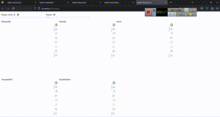

<h1 align="center">Hi 👋, I'm zahra</h1>
# SOM Clustering

Self-Organizing Map (SOM) Clustering Project implemented in Python for unsupervised learning, dimensionality reduction, and data visualization.

---

## 📌 Overview

This project demonstrates the implementation of a **Self-Organizing Map (SOM)** algorithm for clustering and visualizing high-dimensional data.

SOM, also known as a **Kohonen Network**, is an unsupervised neural network that maps complex, high-dimensional input data into a lower-dimensional (usually 2D) representation while preserving the topological structure of the data.

The project focuses on:

* Data preprocessing
* SOM training
* Cluster analysis
* Data visualization
* Unsupervised learning techniques

---

## 🧠 What is a Self-Organizing Map?

A Self-Organizing Map (SOM) is a type of artificial neural network introduced by **Teuvo Kohonen**.

Unlike supervised learning methods, SOM learns patterns in data without labels.

It is commonly used for:

* Clustering
* Feature extraction
* Pattern recognition
* Dimensionality reduction
* Data visualization

The SOM algorithm works by:

1. Initializing neuron weights randomly
2. Finding the Best Matching Unit (BMU)
3. Updating neighboring neurons
4. Repeating the process through multiple iterations

The weight update equation is:

```math
w_i(t+1) = w_i(t) + \alpha(t) h_{ci}(t) [x(t) - w_i(t)]
```

Where:

* `w_i(t)` → neuron weight vector
* `α(t)` → learning rate
* `h_ci(t)` → neighborhood function
* `x(t)` → input vector

---

## 🚀 Features

* ✅ Self-Organizing Map implementation
* ✅ Unsupervised clustering
* ✅ Data preprocessing
* ✅ Visualization of clusters
* ✅ Dimensionality reduction
* ✅ Distance map / U-Matrix visualization
* ✅ Python implementation using scientific libraries
* ✅ Educational and research-oriented structure

---

## 🛠️ Technologies Used

The project is implemented using:

* Python
* NumPy
* Pandas
* Matplotlib
* Scikit-learn
* Jupyter Notebook (if applicable)

---

## 📂 Project Structure

```bash
SOM_Clustering/
│
├── data/                  # Dataset files
├── notebooks/             # Jupyter notebooks
├── images/                # Generated visualizations
├── models/                # Trained SOM models
├── src/                   # Source code
│   ├── preprocessing.py
│   ├── som.py
│   ├── visualization.py
│   └── clustering.py
│
├── requirements.txt
├── README.md
└── main.py
```

> Note: The structure above can be adjusted based on your actual repository files.

---

## 📊 Dataset

Describe the dataset used in this project.

Example:

* Number of samples
* Number of features
* Source of the dataset
* Data type
* Preprocessing steps

You can replace this section with details specific to your dataset.

---

## ⚙️ Installation

Clone the repository:

```bash
git clone https://github.com/Zahraheidari1/SOM_Clustering.git
```

Navigate into the project directory:

```bash
cd SOM_Clustering
```

Install dependencies:

```bash
pip install -r requirements.txt
```

---

## ▶️ Usage

Run the main script:

```bash
python main.py
```

Or open the Jupyter Notebook:

```bash
jupyter notebook
```

---

## 🔍 Workflow

The general workflow of the project is:

1. Load dataset
2. Preprocess data
3. Normalize features
4. Initialize SOM network
5. Train SOM model
6. Find clusters
7. Visualize results
8. Analyze cluster behavior

---

## 📈 Visualization

The project may include the following visualizations:

### U-Matrix

A U-Matrix (Unified Distance Matrix) helps visualize distances between neighboring neurons.

### Cluster Map

Displays how samples are grouped on the SOM grid.

### Heatmaps

Shows feature intensity across neurons.

### Training Progress

Visualizes convergence during training.

---

## 🧪 Example Output

Example outputs may include:

* Cluster assignments
* SOM grid visualization
* Distance maps
* Data grouping patterns
* Reduced-dimensional representations

You can add screenshots in this section.

Example:


<p align="center">
  
</p>


---

## 📚 Algorithm Explanation

### Step 1 — Initialization

The SOM grid is initialized with random weight vectors.

### Step 2 — Competition

The Best Matching Unit (BMU) is selected using Euclidean distance.

### Step 3 — Cooperation

Neighboring neurons around the BMU are selected.

### Step 4 — Adaptation

Weights are updated to become more similar to the input vector.

### Step 5 — Iteration

Training repeats until convergence.

---

## 📉 Advantages of SOM

* Effective for high-dimensional data visualization
* Preserves topological relationships
* Useful for clustering tasks
* Easy to interpret visually
* Works without labeled data

---

## ⚠️ Limitations

* Training may be computationally expensive
* Hyperparameter tuning is important
* Sensitive to initialization
* Results may vary depending on map size

---

## 🔬 Applications of SOM

Self-Organizing Maps are widely used in:

* Bioinformatics
* Medical diagnosis
* Image processing
* Financial analysis
* Customer segmentation
* Pattern recognition
* Anomaly detection
* Recommendation systems

---

## 📖 References

1. Kohonen, T. — *Self-Organizing Maps*
2. Neural Networks and Learning Systems literature
3. Scikit-learn documentation
4. Scientific papers related to SOM clustering

---

## 🤝 Contributing

Contributions are welcome.

If you would like to improve the project:

1. Fork the repository
2. Create a new branch
3. Commit your changes
4. Push to your branch
5. Open a Pull Request

---

## 📝 Future Improvements

Possible future extensions:

* GPU acceleration
* Interactive visualizations
* Deep SOM implementation
* Hybrid clustering methods
* Hyperparameter optimization
* Real-world datasets integration

---

## 📄 License

This project is licensed under the MIT License.

---

## 👩‍💻 Author

Developed by Zahra Heidari.

GitHub Repository:

[https://github.com/Zahraheidari1/SOM_Clustering](https://github.com/Zahraheidari1/SOM_Clustering)

---

## ⭐ Support

If you found this project useful:

* Give the repository a star ⭐
* Fork the project
* Share it with others

---

## 📬 Contact

For questions or collaboration:

* GitHub: [https://github.com/Zahraheidari1](https://github.com/Zahraheidari1)

---

# Thank You ❤️
